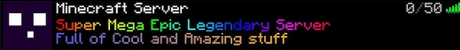

# Stages - Estados del jugador

Cada jugador tendrá un estado en todo momento, cada uno de estos tiene sus propios IDs de paquetes,
más explicado en [README.md](../../README.md)

Los estados pueden ser de los siguientes tipos

## Handshake

Este estado solo se utiliza para identificar al jugador, el servidor no envia ningún paquete, solo el jugador.
Aquí el jugador indica versión del protocolo; diferentes versiones del juego pueden compartir el mismo protocolo,
dirección del servidor al que se conecta; esto es útil cuando tienes más de un servidor alojado en el mismo servidor
en el mismo host y quieres redirigir el tráfico a cada uno individualmente, el puerto y el siguiente estado, el cual
puede ser Status o Login.

## Status

Este es un estado final, que se utiliza para devolverle información al jugador sobre el estado del servidor,
como jugadores, nombre, banner, versión... 
El cliente lo usa para mostrar de una manera gráfica estos datos

 
Una vez el usuario ha recibido esta información se desconecta del servidor sin enviar paquetes adicionales
(descontando los paquetes TCP).

## Login

En este estado se configura la conexión con el servidor, donde es especificará si se usa una conexión encriptada
o si se usa compresión de paquetes.

## Configuration

En este estado como su nombre indica se configurará el juego como tal, modificando texturas, formato del chat,
cookies adicionales del cliente...

## Play

En este estado es donde se manejan todos los paquetes del juego, ya sea de moverse, colocar un bloque, cambiarse de
mundo... Para entender mejor esta sección revisar [Wiki.vg](https://minecraft.wiki/w/Java_Edition_protocol/Packets#Play)